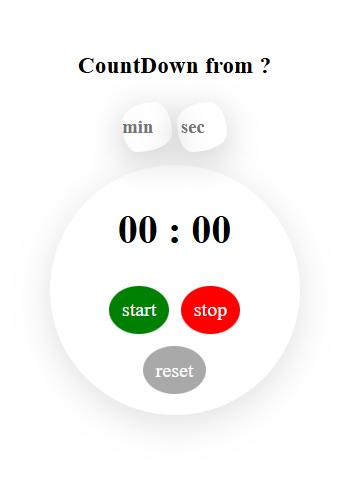
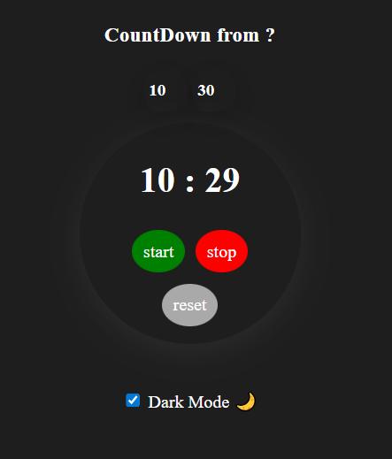

# ⏱️ Simple Timer App

A minimalist and lightweight timer app built with plain HTML, CSS, and JavaScript — no libraries, no frameworks.

Supports:

- ✅ Countdown mode
- ✅ Count-up (stopwatch) mode
- ✅ Dark / Light mode (with `localStorage` persistence)
- ✅ Reset and stop functionality
- ✅ Optional sound notification when countdown ends

---

## 📸 Screenshots

---

## Demo

🔗 [Live Demo (GitHub Pages)](https://your-username.github.io/your-repo-name)

---

## Features

- Start, stop, and reset the timer easily
- Enter minutes and seconds for countdown
- Works as a stopwatch when no time is entered
- Toggle dark/light mode with local storage persistence
- Plays a short beep when countdown finishes

---

## Folder Structure

├── index.html
├── style.css
├── script.js
└── Assets
├── voices
│ └── beep-sound-short-237619.mp3
└── screenshots
├── timer-light.png
└── timer-dark.png

📦 No Dependencies
This project is built 100% with vanilla:

HTML

CSS

JavaScript

No npm, no json-server, no frameworks!

---

License
Free to use, modify, and share.
